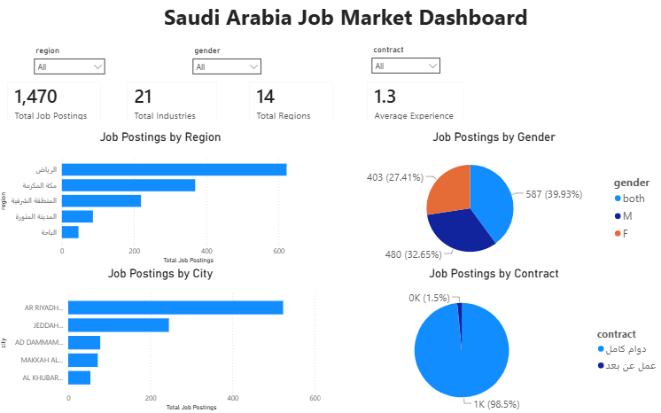

# Saudi Arabia Job Market Analysis




## 📖 About this Project

This project explores the Saudi Arabian job market by analyzing job postings to identify hiring trends across regions, industries, gender requirements, employment contract types, and experience levels.

The project follows an end-to-end data analysis workflow, including data understanding, data cleaning, exploratory data analysis (EDA), statistical analysis, and the development of an interactive Power BI dashboard to support business insights and data-driven decision-making.

---

## 📑 Table of Contents

- [📖 About this Project](#-about-this-project)
- [🎯 Project Objectives](#-project-objectives)
- [📊 Dataset](#-dataset)
- [🛠️ Tools & Technologies](#️-tools--technologies)
- [🔄 Project Workflow](#-project-workflow)
- [❓ Business Questions](#-business-questions)
- [📈 Dashboard Features](#-dashboard-features)
- [💡 Key Insights](#-key-insights)
- [📂 Repository Structure](#-repository-structure)
- [🚀 Future Improvements](#-future-improvements)
- [📜 License](#-license)

---

## 🎯 Project Objectives

The objectives of this project are to:

- Analyze the distribution of job postings across Saudi regions and cities.
- Identify the industries with the highest hiring demand.
- Explore gender requirements in job advertisements.
- Analyze employment contract types.
- Examine experience requirements across different industries.
- Validate relationships between variables using statistical analysis.
- Present the findings through an interactive Power BI dashboard.

---

## 📊 Dataset

The dataset consists of job postings collected from the Saudi Arabian job market.

The dataset includes information such as:

- Job Title
- Company Name
- Region
- City
- Industry
- Gender Requirement
- Employment Contract Type
- Required Experience
- Job Description

> **Note:** This project was developed for educational and portfolio purposes.

---

## 🛠️ Tools & Technologies

- Python
- Pandas
- NumPy
- SciPy
- SQL
- Jupyter Notebook
- Power BI
- Git
- GitHub

---

## 🔄 Project Workflow

1. Data Understanding
2. Data Cleaning
3. Data Cleaning Visualization
4. Exploratory Data Analysis (EDA)
5. Statistical Analysis
6. Power BI Dashboard Development
7. Project Documentation

---

## ❓ Business Questions

This project aims to answer the following business questions:

- Which Saudi regions have the highest concentration of job opportunities?
- Which cities have the largest number of job postings?
- Which industries publish the highest number of job vacancies?
- How are job postings distributed across gender requirements?
- What employment contract types are the most common?
- What is the average experience required by employers?
- Is there a statistically significant relationship between industry and gender requirements?
- Is there a statistically significant relationship between region and industry?

---

## 📈 Dashboard Features

### KPI Cards

- Total Job Postings
- Total Industries
- Total Regions
- Average Experience

### 📊 Interactive Visualizations

- Job Postings by Region
- Job Postings by City
- Gender Distribution
- Employment Contract Distribution

### Interactive Filters

- Region
- Gender
- Employment Contract Type

---

## 💡 Key Insights

Some of the main findings include:

- Riyadh contains the highest concentration of job opportunities.
- Full-time positions dominate the Saudi job market.
- Hiring requirements vary across different industries.
- Job opportunities are concentrated in a limited number of regions and major cities.
- Statistical analysis confirmed a strong relationship between industry and gender requirements.
- Statistical analysis also identified a statistically significant relationship between region and industry.

---

## 📂 Repository Structure

```text
saudi-job-market-analysis/
│
├── dashboard/
│   └── saudi_job_market_dashboard.pbix
│
├── data/
│
├── images/
│   └── dashboard.png
│
├── notebooks/
│   ├── 01_data_understanding.ipynb
│   ├── 02_data_cleaning.ipynb
│   ├── 03_data_cleaning_Visualization.ipynb
│   ├── 04_exploratory_data_analysis.ipynb
│   └── 05_Statistical_Analysis.ipynb
│
├── sql/
├── src/
│
├── README.md
├── requirements.txt
├── LICENSE
└── .gitignore
```

---

## 🚀 Future Improvements

Future enhancements may include:

- Analyze newer Saudi job market datasets for trend comparison.
- Build time-series analysis to monitor hiring trends over time.
- Expand the Power BI dashboard with additional business metrics.
- Develop a web-based interactive dashboard.
- Perform additional statistical analyses using more advanced techniques.

---

## 📜 License

This project is intended for educational and portfolio purposes.